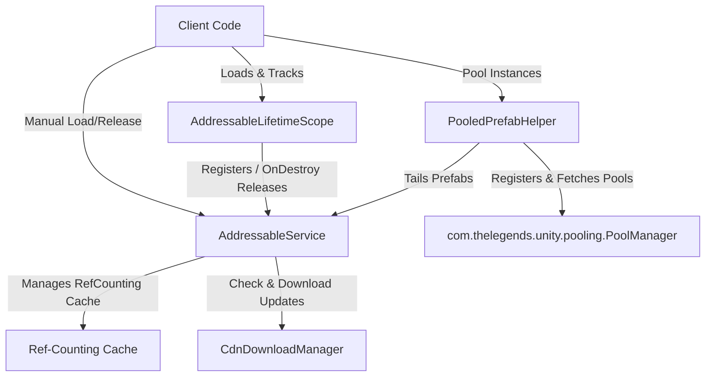

# Unity Addressables Manager Package
`com.thelegends.addressables.manager`

Welcome to the Addressables Manager Wiki. This package provides a mobile-optimized (Zero GC), memory-safe wrapper for Unity's Addressable Asset System. It features reference-counted caching, automatic lifetime-scoped tracking, CDN update & dependency pre-downloading with exponential backoff retries, and seamless integration with the `com.thelegends.unity.pooling` package.

---

## Table of Contents
1. [Core Design Philosophy](#core-design-philosophy)
2. [Architecture Overview](#architecture-overview)
3. [Installation & Setup](#installation--setup)
4. [Configuration](#configuration)
5. [Class Documentation & API Usage](#class-documentation--api-usage)
   - [AddressableService](#1-addressableservice)
   - [AddressableLifetimeScope](#2-addressablelifetimescope)
   - [CdnDownloadManager](#3-cdndownloadmanager)
   - [PooledPrefabHelper](#4-pooledprefabhelper)
6. [Best Practices & Optimization Rules](#best-practices--optimization-rules)

---

## Core Design Philosophy

*   **Zero GC Allocation**: Built entirely on [UniTask](https://github.com/Cysharp/UniTask), avoiding the memory overhead and Garbage Collection spikes associated with traditional Coroutines and C# Tasks on mobile devices.
*   **Reference Counting Cache**: Dynamically manages asset reference counts (`RefCount`). Duplicate concurrent requests share the same loading operation, and assets are only released from memory once their `RefCount` drops to 0.
*   **Safe Cancellation (Zero Double-Releases)**: Decouples cancellation logic from service cleanups. The service propagates cancellation tokens without decrementing the cache unless the caller instructs it. Scope components verify ownership of keys before executing release operations, preventing double-release exceptions.
*   **Decoupled Pooling Integration**: Relies on `com.thelegends.unity.pooling.PoolManager` to handle object pooling, while supplying an adapter bridge (`PooledPrefabHelper`) to fetch prefabs asynchronously and pre-configure pools seamlessly.

---

## Architecture Overview



---

## Installation & Setup

### 1. Register Scoped Registry
Open your Unity project's `Packages/manifest.json` file and register the registry `TheLegends`:
```json
{
  "scopedRegistries": [
    {
      "name": "TheLegends",
      "url": "http://verdaccio.thelegends.io.vn/",
      "scopes": [
        "com.thelegends"
      ]
    },
    {
      "name": "OpenUPM",
      "url": "https://package.openupm.com",
      "scopes": [
        "com.cysharp.unitask"
      ]
    }
  ],
  "dependencies": {
    "com.thelegends.addressables.manager": "1.0.0",
    "com.cysharp.unitask": "2.5.11",
    "com.thelegends.unity.pooling": "1.0.1",
    "com.thelegends.unity.patterns": "1.0.3",
    "com.unity.addressables": "1.28.2"
  }
}
```

### 2. Configure Assembly Definition (asmdef)
Ensure your custom assembly definition files reference the following libraries:
- `UniTask`
- `UniTask.Addressables`
- `Unity.Addressables`
- `Unity.ResourceManager`
- `com.thelegends.addressables.manager`
- `com.thelegends.unity.pooling`
- `com.thelegends.unity.patterns`

---

## Configuration

The package behavior is customized via the `AddressableConfig` ScriptableObject.

### Properties:
*   **Max Retry Count**: The number of download or loading retries when transient network/CDN errors occur.
*   **Retry Delay (Seconds)**: Initial delay duration before initiating retries (exponential backoff scales this delay).
*   **Use Fallback On Failure**: If enabled, loading failures automatically redirect the request to a pre-defined fallback asset.
*   **Fallback Assets**: A mapping list linking original asset keys to fallback `AssetReference` objects (e.g., mapping a high-resolution character model to a standard default box model).

#### Creating Config:
Right-click in the Project window and navigate to:
`Create` -> `The Legends` -> `Addressables` -> `Addressable Config`

---

## Class Documentation & API Usage

### 1. AddressableService
The core singleton coordinator that handles cache management, ref-counting, fallback resolution, and group releases.

#### Initialization
Initialize the service at your game splash screen or loading sequence:
private async UniTask Start()
{
    // Explicit initialization downloads catalogs and pre-warms configuration settings.
    await AddressableService.Instance.InitializeAsync();
}
```

#### Standard Asset Loading
Loads an asset asynchronously, updating the Reference Count and returning the cached instance if already loaded.
```csharp
// Load using a string key
GameObject prefab = await AddressableService.Instance.LoadAssetAsync<GameObject>(
    "characters/hero_knight", 
    destroyCancellationToken, 
    group: "Level1"
);

// Load using an AssetReference
[SerializeField] private AssetReference _textureRef;

Texture2D texture = await AddressableService.Instance.LoadAssetAsync<Texture2D>(
    _textureRef, 
    destroyCancellationToken
);
```

#### Manual Release
Decrements the reference count. When the count reaches 0, the asset is automatically unloaded from Unity memory:
```csharp
AddressableService.Instance.ReleaseAsset("characters/hero_knight");
```

#### Group-based Memory Unloading
To prevent memory leaks when switching levels or scenes, you can release all assets tagged with a specific group identifier:
```csharp
// Unloads all assets marked with group: "Level1" whose RefCount hits 0
AddressableService.Instance.ReleaseGroup("Level1");
```

---

### 2. AddressableLifetimeScope
Attach this MonoBehaviour component to GameObjects to automate asset lifecycle tracking. When the GameObject is destroyed, it releases all registered assets, preventing leaks.

```csharp
public sealed class HeroController : MonoBehaviour
{
    private AddressableLifetimeScope _lifetimeScope;
    private SpriteRenderer _spriteRenderer;

    private void Awake()
    {
        // Cache or add the lifetime scope component
        _lifetimeScope = GetComponent<AddressableLifetimeScope>();
        _spriteRenderer = GetComponent<SpriteRenderer>();
    }

    private async UniTask Start()
    {
        // Load asset through the scope.
        // If this GameObject gets destroyed mid-load, the scope handles cancellation and prevents leaks.
        Sprite sprite = await _lifetimeScope.LoadAssetAsync<Sprite>(
            "textures/hero_idle", 
            this.GetCancellationTokenOnDestroy()
        );
        
        _spriteRenderer.sprite = sprite;
    }
}
```

---

### 3. CdnDownloadManager
Manages catalogs and downloads raw assets/dependencies from your remote CDN with progress reporting and exponential backoff retry loops.

```csharp
private async UniTask UpdateResources()
{
    var downloader = CdnDownloadManager.Instance;
    var token = this.GetCancellationTokenOnDestroy();

    // 1. Check for catalog updates
    List<string> catalogUpdates = await downloader.CheckForCatalogUpdatesAsync(token);
    if (catalogUpdates != null && catalogUpdates.Count > 0)
    {
        // 2. Update catalog
        await downloader.UpdateCatalogsAsync(catalogUpdates, token);
    }

    // 3. Get download size for specific keys/labels
    var keys = new List<string> { "Level2_Assets" };
    long totalBytes = await downloader.GetDownloadSizeAsync(keys, token);
    
    if (totalBytes > 0)
    {
        Debug.Log($"Downloading {totalBytes / 1024 / 1024} MB of assets...");

        // 4. Download with progress reporting
        var progress = new Progress<DownloadProgressStatus>(status =>
        {
            float percentage = status.Progress * 100f;
            Debug.Log($"Progress: {percentage:F1}% ({status.DownloadedBytes}/{status.TotalBytes} bytes)");
        });

        await downloader.DownloadDependenciesAsync(keys, progress, token);
        Debug.Log("CDN Sync Completed!");
    }
}
```

---

### 4. PooledPrefabHelper
An `IDisposable` adapter class bridging `AddressableService` and `PoolManager`. It loads prefabs via Addressables and registers them into the pool manager.

```csharp
public sealed class SpawnManager : MonoBehaviour
{
    [SerializeField] private string _enemyAddressableKey;
    [SerializeField] private Transform _spawnPoint;

    private PooledPrefabHelper _enemyPoolHelper;

    private async UniTask Start()
    {
        _enemyPoolHelper = new PooledPrefabHelper();

        // 1. Initialize helper (Loads prefab from Addressables & pre-registers the pool in PoolManager)
        await _enemyPoolHelper.InitializeAsync(
            _enemyAddressableKey, 
            this.GetCancellationTokenOnDestroy()
        );
    }

    public async UniTask SpawnEnemy()
    {
        // 2. Fetch an instance from the pool
        GameObject enemyInstance = await _enemyPoolHelper.GetInstanceAsync();
        enemyInstance.transform.position = _spawnPoint.position;

        // Perform game logic...
        await UniTask.Delay(TimeSpan.FromSeconds(3f));

        // 3. Return instance to the pool
        _enemyPoolHelper.ReturnInstance(enemyInstance);
    }

    private void OnDestroy()
    {
        // 4. Clean up pool and release the Addressable prefab reference
        _enemyPoolHelper?.Dispose();
    }
}
```

#### UI Pools Propagation:
To initialize the helper for UI pooling, pass UI config properties:
```csharp
await uiPoolHelper.InitializeUiAsync(
    "ui/button_prefab", 
    canvasParentTransform, 
    this.GetCancellationTokenOnDestroy()
);
```

---

## Best Practices & Optimization Rules

1.  **Always Pass CancellationToken**: Under no circumstances should you call any `Load` or `Download` method without propagating a `CancellationToken`. Use `this.GetCancellationTokenOnDestroy()` to bind tasks directly to the caller's life cycle.
2.  **Synchronous Loading Constraints**: Avoid using the obsolete `LoadAssetSync` method. It blocks the main Unity thread and defeats the benefit of async operations. Limit its usage strictly to legacy UI layouts and bootstrap scenes.
3.  **Group Releasing**: Implement group-based tagging (`group: "LevelName"`) for scene-specific textures and audio clips. Call `ReleaseGroup("LevelName")` during scene transition sequences to keep memory footprints low.
4.  **Zero-GC Hot Paths**: Do not trigger asset requests or pool updates inside `Update()`, `FixedUpdate()`, or `LateUpdate()`. Pre-load or pre-warm assets beforehand.
5.  **Clean Disposals**: Classes holding `PooledPrefabHelper` must implement `IDisposable` or clean up references in `OnDestroy` to release pooled assets safely.
