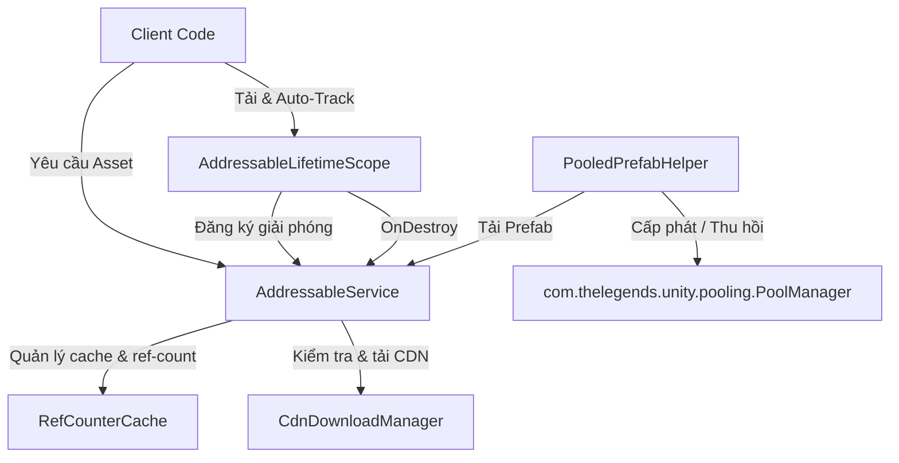

# Reusable Unity Addressables Library (System Design Specification)

Thiết kế một thư viện wrapper Addressables tối ưu cho di động (Zero GC), an toàn bộ nhớ (Reference Counting + Lifetime Scope), và tích hợp hoàn hảo với package Pooling sẵn có của dự án.

---

## Kiến Trúc Tổng Quan (Architecture Overview)

---

## Các Tính Năng Hệ Thống (System Features)

### 1. Kiến Trúc Bất Đồng Bộ Dựa Trên UniTask (UniTask Async Architecture)
* **Zero GC Allocation**: Sử dụng thư viện [UniTask](https://github.com/Cysharp/UniTask) thay thế cho .NET Task tiêu chuẩn và Coroutine nhằm tối ưu hóa CPU và giảm thiểu tối đa rác bộ nhớ (Garbage Collection) trên thiết bị di động.
* **Tích hợp CancellationToken**: Mọi tác vụ tải đơn lẻ, tải hàng loạt và tương tác CDN đều bắt buộc truyền tham số `CancellationToken`. 
* **Quản lý hủy tác vụ động**: Khi xảy ra tín hiệu hủy (Cancellation), UniTask tự động dừng việc chờ đợi và ném ngoại lệ `OperationCanceledException` lập tức, giúp thu hồi tiến trình và bộ nhớ nhanh nhất.

### 2. Quản Lý Vòng Đời & Ref-Counting Cache (Reference Counting)
* Mỗi asset khi tải thành công sẽ được lưu trữ trong một cache nội bộ kèm theo biến đếm tham chiếu (`RefCount`).
* Khi bắt đầu tải hoặc yêu cầu một asset, `RefCount` sẽ tự động tăng lên 1. Nếu asset đã nằm trong cache, trả về trực tiếp từ cache mà không gọi Addressables lần nữa.
* Khi gọi giải phóng (`ReleaseAsset`), `RefCount` giảm xuống 1. Khi `RefCount == 0`, gọi `Addressables.Release(handle)` để giải phóng thực tế khỏi RAM và xóa khỏi cache.

### 3. Tránh Race Condition & Double-Release trên Catch Block
* **Đồng bộ tải song song**: Quản lý Ref-Counting trực tiếp trên `AsyncOperationHandle` ngay từ khi bắt đầu hoạt động tải. Khi nhiều nơi gọi load cùng một asset chưa hoàn thành, các cuộc gọi sau sẽ đợi cùng một handle.
* **Tách biệt trách nhiệm khi hủy (Cancellation)**:
  * Nếu gặp ngoại lệ `OperationCanceledException` (do người dùng hủy hoặc GameObject bị hủy), Service **không tự động giảm Ref-Count**. Trách nhiệm giải phóng lúc này hoàn toàn thuộc về Caller (được thực hiện tự động qua `LifetimeScope` hoặc dọn dẹp thủ công).
  * Nếu gặp các ngoại lệ lỗi thực tế khác (lỗi mạng, file hỏng), Service **vẫn tự động dọn dẹp** (gọi `DecrementRefCount`).

### 4. Tự Động Giải Phóng Qua Lifetime Scope (Pre-tracking)
* Cung cấp một Component `AddressableLifetimeScope` gắn vào `GameObject`.
* Thực hiện **Pre-tracking** (đăng ký key cần dọn dẹp vào danh sách `_trackedKeys` trước khi `await` tải thực sự bắt đầu).
* Kết hợp với việc truyền `CancellationToken` (thường lấy từ `this.GetCancellationTokenOnDestroy()`), đảm bảo:
  * Nếu GameObject bị hủy giữa chừng trong lúc đang tải, `OnDestroy` sẽ giải phóng tài nguyên thành công.
  * Nếu bị hủy bởi một `CancellationToken` tùy biến bên ngoài khi GameObject vẫn còn sống, catch block sẽ tự động giải phóng Ref-Count và rút key khỏi list.
* Sử dụng một danh sách chuỗi duy nhất `List<string> _trackedKeys` để lưu trữ cả string key lẫn GUID chuyển đổi từ `AssetReference`, giúp tối ưu hóa bộ nhớ (Zero GC).

### 5. Tích Hợp Hệ Thống Pooling Sẵn Có (`com.thelegends.unity.pooling`)
* Thư viện không tự quản lý hay viết lại logic pooling. Tất cả các tác vụ quản lý danh sách object, instantiate, recycle và trim bộ nhớ của các instance đều được ủy quyền hoàn toàn cho `com.thelegends.unity.pooling.PoolManager`.
* `PooledPrefabHelper<T>` đóng vai trò là lớp chuyển tiếp (Adapter/Helper):
  - Tải prefab bất đồng bộ an toàn từ `AddressableService`.
  - Đăng ký pool trong `PoolManager` sử dụng chính tham chiếu `GameObject` của prefab làm khóa (`TKey`).
  - Lấy (`Get`) và hoàn trả (`Release`) instance bằng cách gọi các API tương ứng của `PoolManager`.
  - Giải phóng (`Dispose`) dọn dẹp pool trong `PoolManager` và giải phóng asset trong `AddressableService`.

### 6. Quản Lý Tải CDN & Catalog Updates
* `CdnDownloadManager` quản lý việc:
  * Kiểm tra và cập nhật Catalog phiên bản mới từ CDN.
  * Tính toán dung lượng (bytes) cần tải trước cho một danh sách các Key/Label.
  * Tải trước tài nguyên CDN với tiến trình báo cáo phần trăm (`Progress`, `DownloadedBytes`, `TotalBytes`) và tự động thử lại mạng với cơ chế thử lại (exponential backoff retry).
  * Giải phóng toàn bộ các handle tạm thời (`InitializeAsync`, `CheckForCatalogUpdates`, `UpdateCatalogs`) thông qua các khối `finally` để tránh rò rỉ bộ nhớ.

### 7. Khởi Tạo Chủ Động (Explicit Initialization)
* Bắt buộc có hàm `AddressableService.Initialize()` được gọi ở màn hình Loading/Splash Screen để tải trước Catalog, tránh tình trạng giật lag (frame drop) ở lần tải asset đầu tiên trong gameplay.

### 8. Phân Tách Rõ Ràng: Chỉ Tải, Không Khởi Tạo (Load vs Instantiate)
* Thư viện **chỉ cung cấp các hàm tải dữ liệu (`LoadAssetAsync`)**.
* **Tuyệt đối không dùng/cung cấp `Addressables.InstantiateAsync`**. Việc khởi tạo (`Instantiate`) và dọn dẹp game object thuộc về trách nhiệm của hệ thống Pool (`TheLegends.Base.Pool`) hoặc phía logic gọi hàm, tránh tình trạng Addressables và Pool tranh giành quyền quản lý sinh tồn của object.

### 9. Hỗ Trợ Đa Dạng Khóa Tìm Kiếm (String & AssetReference)
* Các hàm tải hỗ trợ Overload (nạp chồng) nhận cả `string key` và `AssetReference`.
* Bên dưới lõi (Core), `AssetReference` sẽ tự động chuyển thành chuỗi (String) để tối ưu lưu trữ trong Cache, mang lại trải nghiệm tiện lợi cho cả Coder và Game Designer.

### 10. Hỗ Trợ Tải Đồng Bộ Chống Cháy (Synchronous Loading)
* Cung cấp hàm `LoadAssetSync` (sử dụng `WaitForCompletion`) làm phương án dự phòng cho các trường hợp bắt buộc (ví dụ: Legacy UI Code).
* Đánh dấu hàm này bằng thuộc tính `[Obsolete]` hoặc chú thích rõ ràng để lập trình viên hạn chế lạm dụng gây lag game.

### 11. Giải Phóng Bộ Nhớ Hàng Loạt Bằng Group/Context
* Hỗ trợ tham số `group` (Ví dụ: `LoadAssetAsync(key, group: "Level1")`).
* Cung cấp hàm `AddressableService.ReleaseGroup(string group)` để tự động quét và dọn sạch các asset thuộc nhóm đó khỏi RAM khi chuyển màn (Scene Unloading) để chống rò rỉ bộ nhớ với các asset tải ngầm (Audio, ScriptableObject).

---

## Đề Xuất Cấu Trúc Thư Mục & File (Directory Structure)

Thư viện sẽ được đặt độc lập trong thư mục `Packages/com.thelegends.addressables.manager/Runtime/Addressables/`:

1. **[AddressableConfig.cs](file:///d:/Projects/UnityPackages/Addressables-Manager/com.thelegends.addressables.manager/Packages/com.thelegends.addressables.manager/Runtime/Addressables/AddressableConfig.cs)**: Cấu hình ScriptableObject (số lần thử lại mạng, liên kết các fallback asset dự phòng).
2. **[AddressableService.cs](file:///d:/Projects/UnityPackages/Addressables-Manager/com.thelegends.addressables.manager/Packages/com.thelegends.addressables.manager/Runtime/Addressables/AddressableService.cs)**: Service lõi quản lý tải, cache đếm tham chiếu (Ref-counting) an toàn đa luồng và lỗi.
3. **[AddressableLifetimeScope.cs](file:///d:/Projects/UnityPackages/Addressables-Manager/com.thelegends.addressables.manager/Packages/com.thelegends.addressables.manager/Runtime/Addressables/AddressableLifetimeScope.cs)**: Component tự động giải phóng tài nguyên theo vòng đời của GameObject, hỗ trợ tải an toàn trước hủy.
4. **[CdnDownloadManager.cs](file:///d:/Projects/UnityPackages/Addressables-Manager/com.thelegends.addressables.manager/Packages/com.thelegends.addressables.manager/Runtime/Addressables/CdnDownloadManager.cs)**: Bộ điều khiển kiểm tra Catalog và tải trước tài nguyên từ CDN với cập nhật tiến trình và Retry.
5. **[PooledPrefabHelper.cs](file:///d:/Projects/UnityPackages/Addressables-Manager/com.thelegends.addressables.manager/Packages/com.thelegends.addressables.manager/Runtime/Addressables/PooledPrefabHelper.cs)**: Adapter cầu nối kết nối giữa Addressables và thư viện `com.thelegends.unity.pooling` của bạn.

---

## Kế hoạch kiểm thử & Xác thực (Verification Plan)

### 1. Kiểm thử tự động (Automated PlayMode/EditMode Tests)
Chúng ta sẽ viết các Unit Test trong `Packages/com.thelegends.addressables.manager/Tests/Addressables/`:
- **Test Race Condition & Cancellation**: Khởi động 2 tác vụ tải cùng 1 asset. Hủy (Cancel) tác vụ thứ 2 giữa chừng. Kiểm tra xem tác vụ 1 có hoàn thành tốt và RefCount của asset sau khi load hoàn tất có bằng 1 hay không.
- **Test Lifetime Scope Leak Protection**: 
  - Gắn `AddressableLifetimeScope` vào một GameObject.
  - Gọi tải một asset và truyền `CancellationToken` của GameObject.
  - Phá hủy GameObject *ngay lập tức* trước khi tác vụ load hoàn tất.
  - Xác nhận rằng sau khi quá trình load ngầm hoàn thành, Ref-Count của asset đó tự động đưa về 0 (đã giải phóng sạch).
- **Test duplicate tracking memory efficiency**: Gọi track nhiều key trùng lặp và xác minh danh sách `_trackedKeys` không chứa phần tử thừa, dung lượng list tối ưu.
- **Test fallback mechanism**: Giả lập lỗi mạng khi tải và xác nhận hệ thống tự trả về asset dự phòng được cấu hình trong `AddressableConfig`.

### 2. Kiểm thử thủ công (Manual Verification)
- Tạo một Scene thử nghiệm (`AddressableTestScene`) để:
  - Cho phép click nút Tải thử Catalog từ CDN và hiển thị thanh tiến trình download.
  - Test nút Spawn / Despawn các vật thể sử dụng `PooledPrefabHelper` để kiểm tra số lượng Object trong Memory Profiler.
  - Ngắt kết nối mạng gia lập để kiểm tra khả năng bắt lỗi Exception và tự động đổi sang Fallback Asset.
